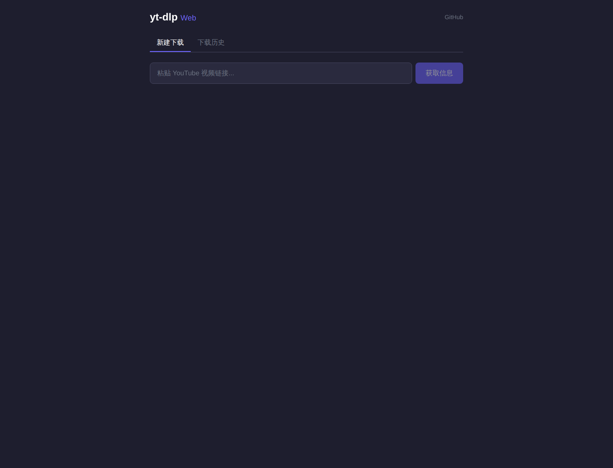
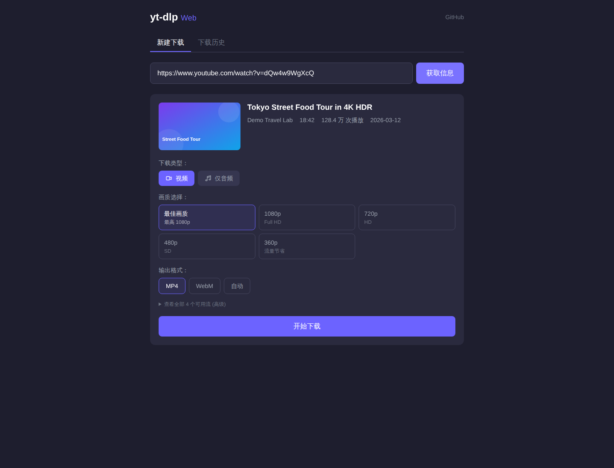
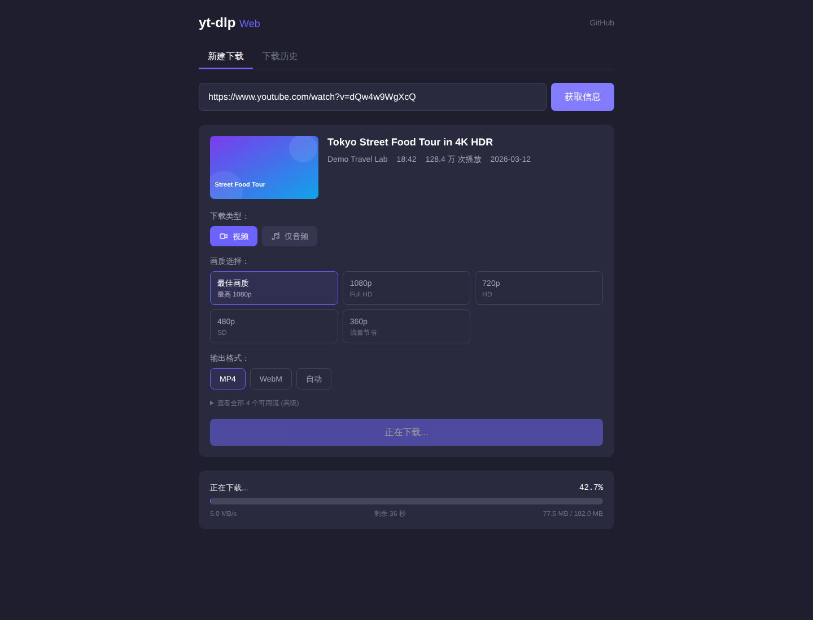
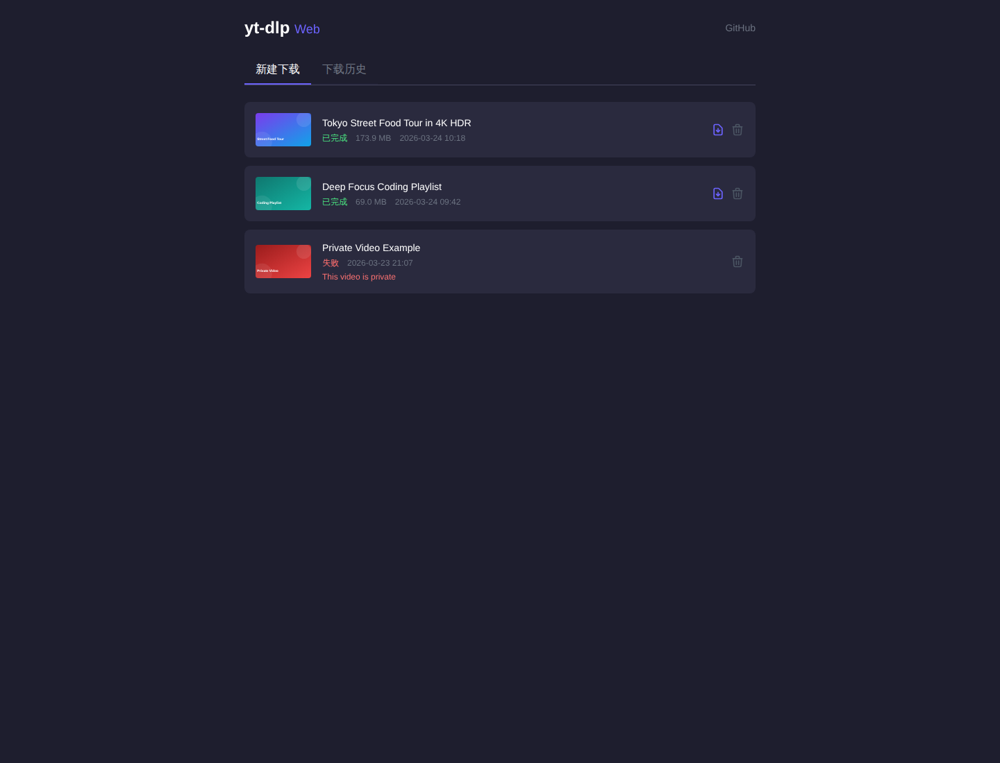

# yt-dlp + Web UI

This repository is a fork of [yt-dlp](https://github.com/yt-dlp/yt-dlp). It keeps the upstream command-line downloader and adds a small `web_app/` service for browser-based downloads.

This fork is optimized for a simple workflow:
- keep the upstream `yt-dlp` core available
- add a lightweight Web UI for interactive downloads
- keep this README short and link to upstream for exhaustive CLI documentation

## Highlights

- Browser UI for pasting a URL and starting a download
- Video/audio mode selection with format preferences
- Real-time progress updates over Server-Sent Events (SSE)
- Download history stored in SQLite
- Finished files can be downloaded back from the browser
- The regular `yt-dlp` CLI is still available from this checkout

# INSTALLATION

## Web UI

### Requirements

- Python 3.10+
- `ffmpeg` / `ffprobe` recommended; required for merge, remux, and audio extraction tasks handled by `yt-dlp`
- A Node runtime available in `PATH` or via `YTDLP_NODE_PATH`
- Optional proxy if you want to seed the initial proxy defaults through `YTDLP_PROXY_URL`
- For public deployment, set `YTDLP_ADMIN_PASSWORD` and `YTDLP_SESSION_SECRET`

### Run from this repository

```bash
./start-web.sh
```

The helper script will reuse an existing Python environment when possible, create `.venv/` only if dependencies are missing, and then start the FastAPI app.

If you want password protection locally:

```bash
YTDLP_ADMIN_PASSWORD='change-me' \
YTDLP_SESSION_SECRET='replace-with-a-random-secret' \
./start-web.sh
```

Manual steps if you prefer:

```bash
python -m pip install -e ".[default]"
python -m pip install -r web_app/requirements.txt
python -m web_app
```

Open `http://localhost:8081` in your browser.

If `YTDLP_ADMIN_PASSWORD` is set, unauthenticated users are redirected to `/login` and must enter the admin password before the main page is shown.

### Run with Docker Compose

```bash
cp .env.example .env
docker compose up -d --build
```

Then open `http://localhost:8081`.

The Compose setup:

- builds the included `Dockerfile`
- installs `ffmpeg` and `nodejs` in the container
- persists downloads and the SQLite database under `./data`
- requires an admin password and session secret from `.env`
- defaults to direct outbound access; proxy can be enabled later in the Web UI settings modal if needed

### Docker Compose deployment steps

If you want to deploy this on a server with Docker Compose:

1. Clone the repository on the target machine.
2. Copy the example environment file.
3. Set a strong admin password and session secret.
4. Start the service with Docker Compose.

Example:

```bash
git clone https://github.com/sn1p4am/videodd.git
cd videodd
cp .env.example .env
```

Edit `.env` and at minimum change:

```dotenv
YTDLP_PUBLIC_PORT=8081
YTDLP_ADMIN_PASSWORD=use-a-strong-password
YTDLP_SESSION_SECRET=use-a-long-random-secret
YTDLP_SESSION_SECURE=true
```

Then start the service:

```bash
docker compose up -d --build
```

Useful commands:

```bash
docker compose ps
docker compose logs -f yt-dlp-web
docker compose restart yt-dlp-web
docker compose down
```

To update after pulling new code:

```bash
git pull
docker compose up -d --build
```

Persistent data is stored in `./data`:

- `./data/downloads` holds downloaded files
- `./data/ytdlp_web.db` holds the SQLite history and saved proxy settings

If you expose this to the public internet, put it behind HTTPS and keep `YTDLP_SESSION_SECURE=true`.

### Current behavior to know about

- `web_app` currently supports **single video URLs only**; playlists are rejected
- Downloads default to `web_app/downloads/`
- Download history defaults to `web_app/ytdlp_web.db`
- Proxy is disabled by default and can be configured from the small settings button in the Web UI header
- The UI can extract metadata, start downloads, stream progress, list history, delete records, and serve completed files

## CLI

If you want to use the CLI from this checkout:

```bash
python -m pip install -e ".[default]"
python -m yt_dlp --version
python -m yt_dlp --help
```

If you only need the standard downloader experience, the upstream project is the best reference:

- Upstream project: https://github.com/yt-dlp/yt-dlp
- Upstream installation wiki: https://github.com/yt-dlp/yt-dlp/wiki/Installation
- Supported sites list: [supportedsites.md](supportedsites.md)

## Web UI

### What it does

The `web_app/` service adds a small HTTP layer around `yt-dlp`:

- `POST /api/extract` extracts title, thumbnail, uploader, duration, and available formats
- `POST /api/download` creates a background download task
- `GET /api/downloads/{task_id}/progress` streams task progress over SSE
- `GET /api/downloads` returns download history
- `GET /api/downloads/{task_id}/file` serves the completed file
- `DELETE /api/downloads/{task_id}` removes the history record and the downloaded file if it still exists
- `GET /api/settings` returns the persisted proxy settings
- `PUT /api/settings/proxy` updates the proxy settings used by subsequent extract/download jobs

### Screenshots

Representative Web UI states:

| Landing page | Extracted media info |
| --- | --- |
|  |  |
| Paste a URL and start from the main download tab. | Review metadata, choose quality, and pick an output format. |

| Live download progress | Download history |
| --- | --- |
|  |  |
| Track a running job with real-time progress updates over SSE. | Browse completed and failed jobs from the built-in history view. |

### Environment variables

| Variable | Default | Description |
| --- | --- | --- |
| `YTDLP_DOWNLOAD_DIR` | `web_app/downloads` | Directory used for downloaded files |
| `YTDLP_DB_PATH` | `web_app/ytdlp_web.db` | SQLite database path for download history |
| `YTDLP_HOST` | `0.0.0.0` | FastAPI bind host |
| `YTDLP_PORT` | `8081` | FastAPI bind port |
| `YTDLP_MAX_CONCURRENT` | `3` | Maximum concurrent background downloads |
| `YTDLP_NODE_PATH` | auto-detect | Node runtime path or executable name |
| `YTDLP_PROXY_URL` | unset | Initial proxy URL saved on first startup; later changes can be made in the UI |
| `YTDLP_PROXY_MODE` | `foreign-only` | Initial proxy mode saved on first startup |
| `YTDLP_ADMIN_PASSWORD` | unset | Enables the admin login page and API protection |
| `YTDLP_SESSION_SECRET` | dev fallback | Secret used to sign the login session cookie |
| `YTDLP_SESSION_SECURE` | `false` | Set `true` when serving over HTTPS |
| `YTDLP_SESSION_MAX_AGE` | `43200` | Session lifetime in seconds |

Example:

```bash
YTDLP_PORT=9090 \
YTDLP_DOWNLOAD_DIR=/data/downloads \
YTDLP_ADMIN_PASSWORD='change-me' \
YTDLP_SESSION_SECRET='replace-me' \
python -m web_app
```

### Public deployment notes

- Put the service behind HTTPS before exposing it on the public internet.
- Change both `YTDLP_ADMIN_PASSWORD` and `YTDLP_SESSION_SECRET` from the example values.
- Keep `YTDLP_SESSION_SECURE=true` in Docker deployments that are accessed over HTTPS.
- Public deployment can stay direct by default; if you later need a proxy, enable it from the header settings modal after login.

## Project structure

```text
.
├── yt_dlp/                 # Upstream downloader package
├── web_app/                # FastAPI + Vue-based Web UI extension
│   ├── main.py             # App bootstrap
│   ├── downloader.py       # yt-dlp integration and background jobs
│   ├── database.py         # SQLite persistence
│   ├── routes/             # API and SSE endpoints
│   └── static/             # Login page and browser UI
├── Dockerfile              # Container image for the Web UI
├── compose.yml             # Compose deployment for public/private hosting
├── supportedsites.md       # Supported extractor list
├── CONTRIBUTING.md         # Upstream-oriented contribution guide
└── README.md               # This fork-specific overview
```

## Upstream documentation

This README intentionally stays short. For the full `yt-dlp` documentation, use the upstream project:

- Main documentation: https://github.com/yt-dlp/yt-dlp#readme
- Installation: https://github.com/yt-dlp/yt-dlp/wiki/Installation
- FAQ: https://github.com/yt-dlp/yt-dlp/wiki/FAQ
- Embedding guide: https://github.com/yt-dlp/yt-dlp#embedding-yt-dlp
- Full option reference: https://github.com/yt-dlp/yt-dlp#usage-and-options

# USAGE AND OPTIONS

## General Options:

The detailed CLI option list is maintained by upstream `yt-dlp` and can be regenerated from the standard help output when needed.

# CONFIGURATION

For full configuration syntax and examples, use the upstream documentation:
- https://github.com/yt-dlp/yt-dlp#configuration
- https://github.com/yt-dlp/yt-dlp/wiki/FAQ

The Web UI in this fork is configured primarily through environment variables documented above.

# COMPILE

This repository still follows the upstream `yt-dlp` build flow.

If you need to build binaries or package artifacts, start with the upstream instructions:
- https://github.com/yt-dlp/yt-dlp#compile

For normal local development of this fork, the editable install plus `python -m web_app` is usually enough.

# EMBEDDING YT-DLP

The Python package remains available from this checkout, so upstream embedding guidance still applies:
- https://github.com/yt-dlp/yt-dlp#embedding-yt-dlp

# CHANGES FROM YOUTUBE-DL

This fork inherits the behavior of `yt-dlp` relative to `youtube-dl`.

Use the upstream reference for the complete migration notes:
- https://github.com/yt-dlp/yt-dlp#changes-from-youtube-dl

## Differences in default behavior

See:
- https://github.com/yt-dlp/yt-dlp#differences-in-default-behavior

## Deprecated options

See:
- https://github.com/yt-dlp/yt-dlp#deprecated-options

## Format Selection

For format selection details in this fork, use the upstream documentation:
- https://github.com/yt-dlp/yt-dlp#format-selection

## Sorting Formats

For format sorting details, use the upstream documentation:
- https://github.com/yt-dlp/yt-dlp#sorting-formats

## Preset Aliases

For preset alias details, use the upstream documentation:
- https://github.com/yt-dlp/yt-dlp#preset-aliases

## Internet Shortcut Options

For internet shortcut option details, use the upstream documentation:
- https://github.com/yt-dlp/yt-dlp#internet-shortcut-options

## SponSkrub SponsorBlock Options

For SponsorBlock-related option details, use the upstream documentation:
- https://github.com/yt-dlp/yt-dlp#sponskrub-sponsorblock-options

## Release Files

This fork may produce the usual upstream-style release artifacts such as source archives, PyPI files, and platform builds.

For this fork, use the workflow and filenames attached to the release itself as the source of truth.


Upstream `yt-dlp` is licensed under the [Unlicense](LICENSE). This fork keeps the same project base and should be reviewed together with the upstream licensing and bundled dependency notes when distributing binaries or modified builds.
